<!-- Animated Header -->

  

<!-- Typing Animation -->

  

<!-- Badges Row -->

  
  
  

  
  
  

---

<!-- About Section with Image -->
<table>
  <tr>
    <td width="60%">
      <h2>🎯 About Me</h2>
      

        I'm <b>Zein Al-Ali</b>, documenting my journey from <b>zero to SOC Analyst</b> in 24 weeks — publicly.
      

      <ul>
        <li>🔥 Currently completing <b>Project 1: Live SOC Monitoring</b></li>
        <li>📊 Triaging real alerts on <b>LetsDefend</b></li>
        <li>📝 Publishing <b>daily case studies</b> with IOCs & timelines</li>
        <li>🛡️ Learning: <b>MITRE ATT&CK</b> | <b>SIEM</b> | <b>Log Analysis</b></li>
      </ul>
    </td>
    <td width="40%" align="center">
      
    </td>
  </tr>
</table>

---

## 🛤️ My 24-Week Roadmap

```mermaid
graph LR
    A[🟢 Project 1<br/>Live SOC Monitoring] --> B[🟡 Project 2<br/>Phishing Analysis]
    B --> C[🟡 Project 3<br/>Incident Response]
    C --> D[🔵 Project 4<br/>Ransomware Forensics]
    D --> E[🔵 Project 5<br/>Threat Hunting]
    E --> F[🔴 Project 6<br/>Detection Engineering]
    style A fill:#2ea043,stroke:#fff,stroke-width:2px,color:#fff
    style B fill:#1f6feb,stroke:#fff,stroke-width:2px,color:#fff
    style C fill:#1f6feb,stroke:#fff,stroke-width:2px,color:#fff
    style D fill:#8957e5,stroke:#fff,stroke-width:2px,color:#fff
    style E fill:#8957e5,stroke:#fff,stroke-width:2px,color:#fff
    style F fill:#da3633,stroke:#fff,stroke-width:2px,color:#fff
```

🛠️ Tech Stack

  

  
  
  
  
  

📊 GitHub Stats

  
  

  

🏆 GitHub Trophies

  

🐍 Contribution Snake

  <picture>
    <source media="(prefers-color-scheme: dark)" srcset="https://raw.githubusercontent.com/Artifact0x0/Artifact0x0/output/github-contribution-grid-snake-dark.svg" />
    <source media="(prefers-color-scheme: light)" srcset="https://raw.githubusercontent.com/Artifact0x0/Artifact0x0/output/github-contribution-grid-snake.svg" />
    
  </picture>

📫 Connect With Me

  
  
  

  

  

