<div align="center">



<br/>

# 🔐 Artifact0x0

> **Cybersecurity Learning & Vulnerability Research Hub**  
> Vulnerability Documentation | Case Studies | Learning Journey

<div style="margin: 20px 0;">


</div>

</div>

---

## 📖 About This Repository

This repository documents **my complete cybersecurity learning journey** with practical research and documentation:

- 🔍 **Vulnerability Writeups** - Detailed analysis of security vulnerabilities with solutions & lessons
- 📊 **Case Studies** - Real-world incident analysis with IOCs and MITRE ATT&CK mapping
- 📚 **Educational Content** - Tutorials, tips, best practices & security fundamentals
- 🛠️ **Tools & Scripts** - Practical utilities developed throughout my learning journey
- 💡 **Articles & Research** - Insights, tips & experiences from hands-on security work

---

## 📂 Repository Structure

```
Artifact0x0/
│
├── 📕 writeups/                    # Detailed Vulnerability Documentation
│   ├── web-vulnerabilities/        # Web Application Vulnerabilities
│   ├── network-security/           # Network & Infrastructure Security
│   ├── system-hardening/           # System Hardening & Defense
│   └── incident-response/          # Incident Response & Analysis
│
├── 📊 case-studies/                # Real-World Case Studies
│   ├── apt-campaigns/              # Advanced Persistent Threats
│   ├── breach-analysis/            # Breach Post-Mortems
│   ├── malware-analysis/           # Malware & Ransomware Analysis
│   └── real-world-incidents/       # Live Incident Documentation
│
├── 📚 learning-journey/            # My Learning Progress
│   ├── completed-certifications/   # Completed Certifications
│   ├── courses-progress/           # Active Course Progress
│   ├── skills-tracker/             # Technical Skills Development
│   └── milestones/                 # Achievements & Milestones
│
├── 💡 articles-tips/               # Articles, Tips & Insights
│   ├── security-best-practices/    # Security Best Practices
│   ├── quick-tips/                 # Quick Security Tips
│   ├── tool-reviews/               # Tool Analysis & Reviews
│   └── lessons-learned/            # Key Lessons & Takeaways
│
├── 🛠️ tools-scripts/               # Tools, Scripts & Automation
│   ├── python-utilities/           # Python Security Tools
│   ├── bash-scripts/               # Bash Automation Scripts
│   ├── detection-rules/            # YARA & Sigma Rules
│   └── automation/                 # Security Automation
│
└── 📖 README.md                    # You are here
```

---

## 🔥 Latest Additions

### Recent Writeups
- 🆕 **SQL Injection in Login Forms** - Comprehensive analysis with exploitation techniques
- 🆕 **XXE Vulnerabilities** - XML External Entity attacks with practical examples
- 🆕 **API Authentication Bypass** - Common authentication weaknesses & bypass methods

### Case Studies
- 🆕 **WannaCry Ransomware Campaign** - Complete timeline & analysis
- 🆕 **Log4Shell Exploitation** - Deep dive into CVE-2021-44228

### Tips & Best Practices
- 💡 **5 Common Penetration Testing Mistakes**
- 💡 **Effective Vulnerability Validation Techniques**

---

## 🎯 Learning Paths

### Beginner Level 🟢
```
✅ Networking Fundamentals
✅ Security Basics & Concepts
✅ Introduction to Penetration Testing
→ Progress: Ongoing
```

### Intermediate Level 🟡
```
✅ Malware Analysis Basics
✅ Web Application Testing
→ Progress: In Progress
→ OSINT Fundamentals
```

### Advanced Level 🔴
```
→ Coming Soon...
```

---

## 📊 Progress Tracker

| Metric | Count |
|--------|-------|
| **Vulnerability Writeups** | 15+ 📈 |
| **Case Studies** | 8+ 📈 |
| **Articles & Tips** | 12+ 📈 |
| **Tools Developed** | 7+ 📈 |
| **Skills Acquired** | 25+ 📈 |
| **Learning Hours** | 200+ 📈 |

---

## 🔧 Tech Stack & Tools

### Programming Languages
<div align="center">

</div>

### Core Technologies
<div align="center">

</div>

### Security Platforms Used

| Platform | Status |
|----------|--------|
| **LetsDefend** | 🔴 Rank #6 Syria - Active |
| **HackTheBox** | 🟡 In Progress |
| **TryHackMe** | 🟡 In Progress |
| **PentesterLab** | 🟢 Completed Courses |

---

## 🚀 How to Use This Repository

### For Beginners 🟢
```
1. Start with Learning Journey section
2. Read articles and quick tips
3. Follow beginner-level writeups
```

### For Intermediate Learners 🟡
```
1. Study the case studies
2. Work on similar challenges
3. Use provided tools & scripts
```

### For Advanced Learners 🔴
```
1. Analyze complex case studies
2. Review advanced techniques
3. Contribute improvements
```

---

## ⭐ Recommended Starting Points

### Get Started Quick
- 📖 [Web Security Fundamentals](./articles-tips/security-best-practices/)
- 🎯 [Your First Vulnerability Hunt](./learning-journey/milestones/)

### Deep Dives
- 🔍 [Complete SQL Injection Walkthrough](./writeups/web-vulnerabilities/)
- 📊 [Real APT Campaign Analysis](./case-studies/apt-campaigns/)

### Ready-to-Use Tools
- 🛠️ [Automated Scanning Scripts](./tools-scripts/automation/)
- 🔐 [Detection Rules & Signatures](./tools-scripts/detection-rules/)

---

## 📈 Regular Updates

This repository is updated **consistently** with:
- ✅ New writeups weekly
- ✅ Learning journey updates
- ✅ Fresh articles & insights
- ✅ Improved tools & automation

---

## 🔗 Let's Connect

<div align="center">

| Platform | Link |
|----------|------|
| **Twitter/X** | [@Artifact0x0](https://x.com/Artifact0x0) |
| **Medium** | [@Artifact0x0](https://medium.com/@Artifact0x0) |
| **LinkedIn** | [Artifact0x0](https://linkedin.com/in/artifact0x0) |
| **Email** | artifact0x0@example.com |

</div>

---

## 💡 Tips for Maximum Learning

1. **Follow the path** - Start at your appropriate level
2. **Practice hands-on** - Don't just read, experiment yourself
3. **Ask & engage** - Share your questions and insights
4. **Review past content** - Revisit topics for reinforcement
5. **Share your progress** - Tell others what you've learned

---

## 📄 License & Disclaimer

All content in this repository is for **educational and authorized security research only**.

⚠️ **Important**: Use this knowledge only on systems where you have explicit permission to test.

---

<div align="center">

### 🚀 Start Your Security Journey Today!

**Made with ❤️ for the cybersecurity community**

<br/>


</div>


